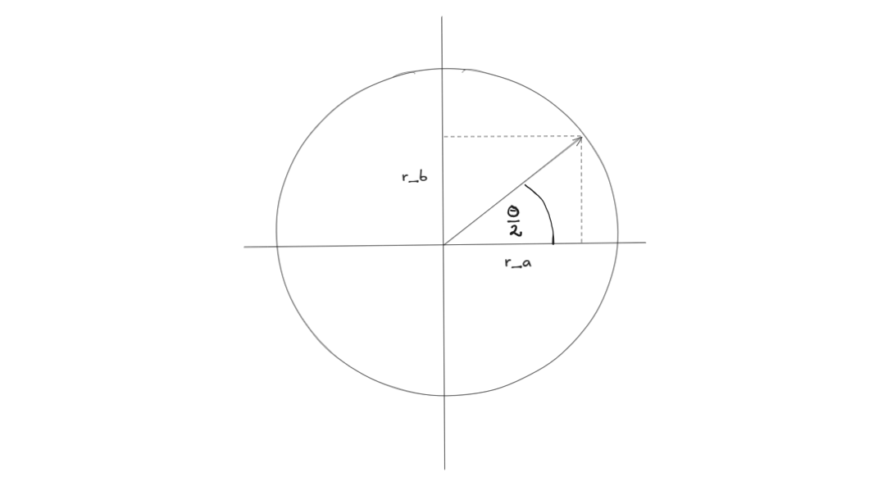
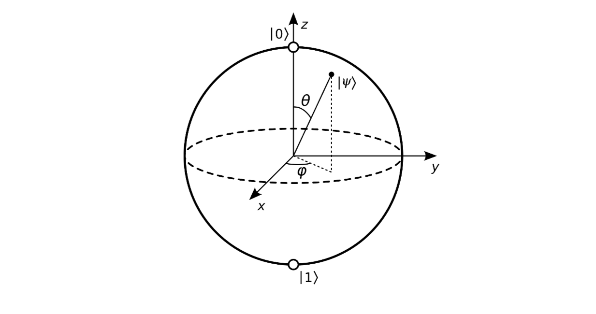

## Documentation
- Specification: [BlochSphereSimulator.pdf](https://github.com/KlevisImeri/BlochSphere/blob/main/BlochSphereSimulator.pdf)
- Documentation: [Documentation_BlochSphereSimualtor.pdf](https://github.com/KlevisImeri/BlochSphere/blob/main/Documentation_BlochSphereSimulator.pdf)

## Running the program

1. If you have bun installed you can run it locally as:
```
$ bun install
$ bun vite
```
in your terminal.
Then just open `http://localhost:5173/BlochSphere` in your browser.

2. You can also run it locally by serving the dist folder
```
$ cd dist
$ python -m http.server 8000
```
Then just open `http://0.0.0.0:8000/` in your browser.

3. Or if you don't want to configure anything you can go to `https://klevisimeri.github.io/BlochSphere/` which is already serving the running program.


### How to do Conversions
[Video that helped with caculations](https://www.youtube.com/watch?v=a-dIl1Y1aTs)

Lets have a qubit:

$$\begin{align*}  
|ψ⟩ &= α|0〉 + β|1〉, \quad α, β ∈ ℂ, \quad |α|² + |β|² = 1 \\  
&= r_α e^{i φ_α} |0〉 + r_β e^{i φ_β} |1〉 \quad \text{(multiply by } e^{-i φ_α}\text{ global phaze)} ⩓ |ψ⟩ ≡ e^{iγ}|ψ⟩ \\  
&≡ r_α |0〉 + r_β e^{i (φ_β - φ_α)} |1〉 \\    
\end{align*}$$

Now we know that $|e^{i (φ_β - φ_α)}|^2=1$. A phaze shift doesn't have any effect when caculating the lengths of complex numbers. This implies that:

$$\begin{align*}
r_α, r_β &∈ ℝ,  \quad r_α² + r_β² = 1 \quad ⟹  \quad r_α, r_β ∈ [0, 1] \\  
\end{align*}$$

We know that because of $r_α² + r_β² = 1$ the $r_α$ and $r_β$ can be represented in the unit circle as axis values.
Let $\frac{θ}{2}$ be the angle creating this values. We chose $\frac{1}{2}$ because we want $θ ∈ [0, π]$.
Ther is no much meaning behind why we chose $\frac{1}{2}$ we are just trying to represent the equations with two angles that fit our description of a poloar and aizmuthal angle.
So what we are trying to do from he beginning is to represent $|ψ⟩$ as a fucntion of $f(φ,θ)$.
Mathematically:

$$ |ψ⟩ = f(φ,θ) \quad s.t \quad φ ∈ [0, 2π],  θ ∈ [0, π]  $$




Putting everything together:

$$\begin{align*}
|ψ⟩ &= \cos \frac{θ}{2} |0〉 + \sin \frac{θ}{2} e^{i φ} |1〉 \\  
φ &≔ φ_β - φ_α = \arg(β)−\arg(α) =\arg(|\frac{β}{α}|),  \quad φ ∈ [0, 2π] \quad \text{(azimuthal angle)} \\  
θ &= 2 \cos⁻¹(r_α) \\  
&= 2 \sin⁻¹(r_β) \\
&=2\arctan \frac{r_β}{r_α} = 2\arctan |\frac{β}{α}| \quad θ ∈ [0, π] \quad \text{(polar angle)}
\end{align*}$$

one more thing to notice is that



The image was taken from: https://en.wikipedia.org/wiki/Bloch_sphere#/media/File:Bloch_sphere.svg
Well let's also include the global phaze wich we dont really need:

$$|ψ⟩ ≡ e^{iγ}|ψ⟩ = e^{iγ}f(φ,θ) = e^{iγ}[\cos \frac{θ}{2} |0〉 + \sin \frac{θ}{2} e^{i φ} |1⟩] \quad γ,θ,φ ∈ ℝ $$

or in other words qubits are equivalent under a global phaze becuae the global phaze dissapears when me meausure so we can't see its effect at all, not even in interferece (like the phaze usually does).

Here is the code to do the conversions:
```java
export function convertQubit(qubit: QubitVector): QubitPolar {
  const [alpha, beta] = qubit
  // magnitudes
  const rAlpha: number = abs(alpha) as number;
  const rBeta: number = abs(beta) as number;
  // arguments (phases)
  const phiAlpha: number = arg(alpha) as number;
  const phiBeta: number = arg(beta) as number;
  // polar angle θ = 2 * arccos(|α|)
  const theta = 2 * Math.acos(rAlpha);
  // azimuthal angle φ = φ_β - φ_α, normalized to [0, 2π)
  let phi = phiBeta - phiAlpha;
  phi = ((phi % (2 * Math.PI)) + 2 * Math.PI) % (2 * Math.PI);

  return { theta, phi };
}
```


This are all the fucntoins in the scope:
```java
function createEvalContext() {
    // Create math instance with all functions
    const math = create(all, {});

    return {
      // Core math.js functions
      matrix: math.matrix,
      multiply: math.multiply,
      sqrt: math.sqrt,
      complex: math.complex,
      add: math.add,
      subtract: math.subtract,
      divide: math.divide,
      pow: math.pow,
      exp: math.exp,
      log: math.log,
      sin: math.sin,
      cos: math.cos,
      tan: math.tan,
      pi: math.pi,
      e: math.e,
      abs: math.abs,
      conj: math.conj,
      re: math.re,
      im: math.im,
      arg: math.arg,
      norm: math.norm,
      
      // Matrix-specific functions
      ctranspose: math.ctranspose,
      transpose: math.transpose,
      det: math.det,
      inv: math.inv,
      
      // Your custom functions
      show,
      clear,
      M,
      
      // Constants
      i: math.complex(0, 1),
      π: math.pi,
      
      // Namespace fallback (just in case)
      math
    };
}

```
## To do for the future
- Labels for vectors 

